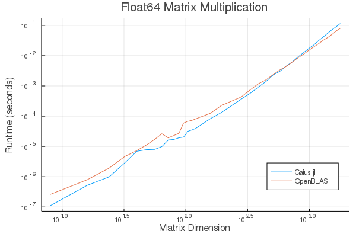
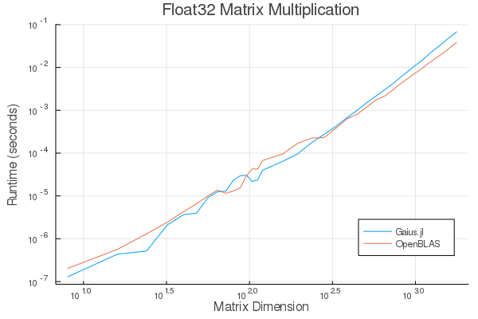
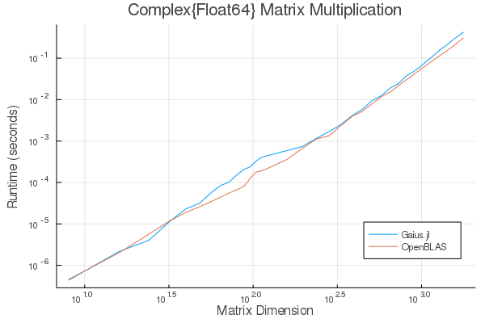
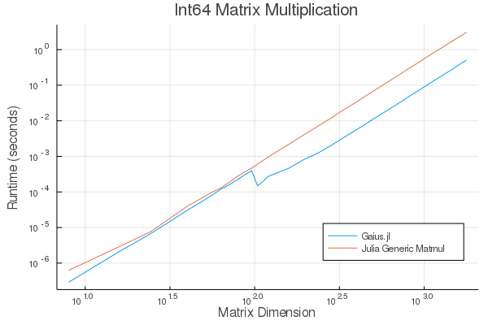
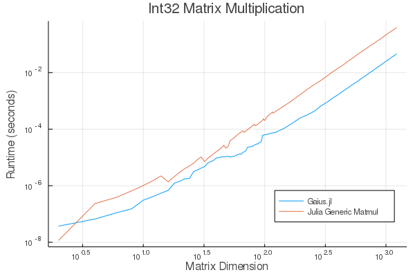

# Gaius.jl

*Because Caesar.jl was taken*

[![Continuous Integration][ci-img]][ci-url]
[![Continuous Integration (Julia nightly)][ci-julia-nightly-img]][ci-julia-nightly-url]
[![Code Coverage][codecov-img]][codecov-url]

[ci-url]: https://github.com/MasonProtter/Gaius.jl/actions?query=workflow%3ACI
[ci-julia-nightly-url]: https://github.com/MasonProtter/Gaius.jl/actions?query=workflow%3A%22CI+%28Julia+nightly%29%22
[codecov-url]: https://codecov.io/gh/MasonProtter/Gaius.jl

[ci-img]: https://github.com/MasonProtter/Gaius.jl/workflows/CI/badge.svg "Continuous Integration"
[ci-julia-nightly-img]: https://github.com/MasonProtter/Gaius.jl/workflows/CI%20(Julia%20nightly)/badge.svg "Continuous Integration (Julia nightly)"
[codecov-img]: https://codecov.io/gh/MasonProtter/Gaius.jl/branch/master/graph/badge.svg "Code Coverage"

Gaius.jl is a multi-threaded BLAS-like library using a divide-and-conquer
strategy to parallelism, and built on top of the **fantastic**
[LoopVectorization.jl](https://github.com/chriselrod/LoopVectorization.jl).
Gaius spawns threads using Julia's depth first parallel task runtime and so
Gaius's routines may be fearlessly nested inside multi-threaded Julia programs.

Gaius is *not* stable or well tested. Only use it if you're adventurous.

Note: Gaius is not actively maintained and I do not anticipate doing further
work on it. There are other, more promising projects that may result in a
scalable, multi-threaded pure Julia BLAS library such as:
1. [Tullio.jl](https://github.com/mcabbott/Tullio.jl)
2. [Octavian.jl](https://github.com/JuliaLinearAlgebra/Octavian.jl)

However, you may find this library useful as a relatively simple playground
for learning about the implementation of linear algebra routines.

## Quick Start

```julia
julia> using Gaius

julia> Gaius.mul!(C, A, B) # (multi-threaded) multiply A×B and store the result in C (overwriting the contents of C)

julia> Gaius.mul(A, B) # (multi-threaded) multiply A×B and return the result

julia> Gaius.mul_single_threaded!(C, A, B) # (single-threaded) multiply A×B and store the result in C (overwriting the contents of C)

julia> Gaius.mul_single_threaded(A, B) # (single-threaded) multiply A×B and return the result
```

Remember to start Julia with multiple threads with e.g. one of the following:
- `julia -t auto`
- `julia -t 4`
- Set the `JULIA_NUM_THREADS` environment variable to `4` **before** starting Julia

The functions in this list are part of the public API of Gaius:
- `Gaius.mul!`
- `Gaius.mul`
- `Gaius.mul_single_threaded!`
- `Gaius.mul_single_threaded`

All other functions are internal (private).

## Matrix Multiplication

Currently, fast, native matrix-multiplication is only implemented
between matrices of types `Matrix{<:Union{Float64, Float32, Int64,
Int32, Int16}}`, and `StructArray{Complex}`. Support for other other
commonly encountered numeric `struct` types such as `Rational` and
`Dual` numbers is planned.

### Using Gaius

<details>

<summary>Click to expand:</summary>

Gaius defines the public functions `Gaius.mul` and
`Gaius.mul!`. `Gaius.mul` is to be used like the regular `*`
operator between two matrices whereas `Gaius.mul!` takes in three
matrices `C, A, B` and stores `A*B` in `C` overwriting the contents of
`C`.

The functions `Gaius.mul` and `Gaius.mul!` use multithreading. If you
want to run the single-threaded variants, use `Gais.mul_single_threaded` and
`Gaius.mul_single_threaded!` respectively.

```julia
julia> using Gaius, BenchmarkTools, LinearAlgebra

julia> A, B, C = rand(104, 104), rand(104, 104), zeros(104, 104);

julia> @btime mul!($C, $A, $B); # from LinearAlgebra
  68.529 μs (0 allocations: 0 bytes)

julia> @btime mul!($C, $A, $B); #from Gaius
  31.220 μs (80 allocations: 10.20 KiB)
```

```julia
julia> using Gaius, BenchmarkTools

julia> A, B = rand(104, 104), rand(104, 104);

julia> @btime $A * $B;
  68.949 μs (2 allocations: 84.58 KiB)

julia> @btime let * = Gaius.mul # Locally use Gaius.mul as * operator.
           $A * $B
       end;
  32.950 μs (82 allocations: 94.78 KiB)

julia> versioninfo()
Julia Version 1.4.0-rc2.0
Commit b99ed72c95* (2020-02-24 16:51 UTC)
Platform Info:
  OS: Linux (x86_64-pc-linux-gnu)
  CPU: AMD Ryzen 5 2600 Six-Core Processor
  WORD_SIZE: 64
  LIBM: libopenlibm
  LLVM: libLLVM-8.0.1 (ORCJIT, znver1)
Environment:
  JULIA_NUM_THREADS = 6
```

Multi-threading in Gaius works by recursively splitting matrices
into sub-blocks to operate on. You can change the matrix sub-block
size by calling `mul!` with the `block_size` keyword argument. If left
unspecified, Gaius will use a (very rough) heuristic to choose a good
block size based on the size of the input matrices.

The size heuristics I use are likely not yet optimal for everyone's
machines.

</details>

### Complex Numbers

<details>

<summary>Click to expand:</summary>

Gaius supports the multiplication of matrices of complex numbers,
but they must first by converted explicity to structs of arrays using
StructArrays.jl (otherwise the multiplication will be done by OpenBLAS):

```julia
julia> using Gaius, StructArrays

julia> begin
           n = 150
           A = randn(ComplexF64, n, n)
           B = randn(ComplexF64, n, n)
           C = zeros(ComplexF64, n, n)


           SA =  StructArray(A)
           SB =  StructArray(B)
           SC = StructArray(C)

           @btime mul!($SC, $SA, $SB)
           @btime         mul!($C, $A, $B)
           SC ≈ C
       end
   515.587 μs (80 allocations: 10.53 KiB)
   546.481 μs (0 allocations: 0 bytes)
 true
```

</details>

### Benchmarks

#### Floating Point Performance

<details>

<summary>Click to expand:</summary>

The following benchmarks were run on this
```julia
julia> versioninfo()
Julia Version 1.4.0-rc2.0
Commit b99ed72c95* (2020-02-24 16:51 UTC)
Platform Info:
  OS: Linux (x86_64-pc-linux-gnu)
  CPU: AMD Ryzen 5 2600 Six-Core Processor
  WORD_SIZE: 64
  LIBM: libopenlibm
  LLVM: libLLVM-8.0.1 (ORCJIT, znver1)
Environment:
  JULIA_NUM_THREADS = 6
```

and compared to [OpenBLAS](https://github.com/xianyi/OpenBLAS) running with
`6` threads (`BLAS.set_num_threads(6)`). I would be keenly interested in seeing
analogous benchmarks on a machine with an AVX512 instruction set and/or
[Intel's MKL](https://software.intel.com/en-us/mkl).





*Note that these are log-log plots.*

Gaius outperforms [OpenBLAS](https://github.com/xianyi/OpenBLAS) over a large
range of matrix sizes, but
does begin to appreciably fall behind around `800 x 800` matrices for
`Float64` and `650 x 650` matrices for `Float32`. I believe there is a
large amount of performance left on the table in Gaius and I look
forward to beating OpenBLAS for more matrix sizes.

</details>

#### Complex Floating Point Performance

<details>

<summary>Click to expand:</summary>

Here is Gaius operating on `Complex{Float64}` structs-of-arrays
competeing relatively evenly against OpenBLAS operating on
`Complex{Float64}` arrays-of-structs:



I think with some work, we can do much better.

</details>

#### Integer Performance

<details>

<summary>Click to expand:</summary>

These benchmarks compare Gaius (on the same machine as above) and
compare against Julia's generic matrix multiplication implementation
(OpenBLAS does not provide integer mat-mul) which is not
multi-threaded.





*Note that these are log-log plots.*

Benchmarks performed on a machine with the AVX512 instruction set show an
[even greater performance gain](https://github.com/chriselrod/LoopVectorization.jl).

If you find yourself in a high performance situation where you want to
multiply matrices of integers, I think this provides a compelling
use-case for Gaius since it will outperform it's competition at
*any* matrix size and for large matrices will benefit from
multi-threading.

</details>

## Other BLAS Routines

I have not yet worked on implementing other standard BLAS routines
with this strategy, but doing so should be relatively straightforward.

## Safety

*If you must break the law, do it to seize power; in all other cases observe it.*

-Gaius Julius Caesar

If you use only the functions `Gaius.mul!`, `Gaius.mul`,
`Gaius.mul_single_threaded!`, and `Gaius.mul_single_threaded`,
automatic array size-checking will occur before
the matrix multiplication begins. This can be turned off in
`mul!` by calling `Gaius.mul!(C, A, B; sizecheck=false)`, in
which case no sizechecks will occur on the arrays before the matrix
multiplication occurs and all sorts of bad, segfaulty things can
happen.

All other functions in this package are to be considered *internal*
and should not be expected to check for safety or obey the law. The
functions `Gaius.gemm_kernel!` and `Gaius.add_gemm_kernel!` may be of
utility, but be warned that they do not check array sizes.
